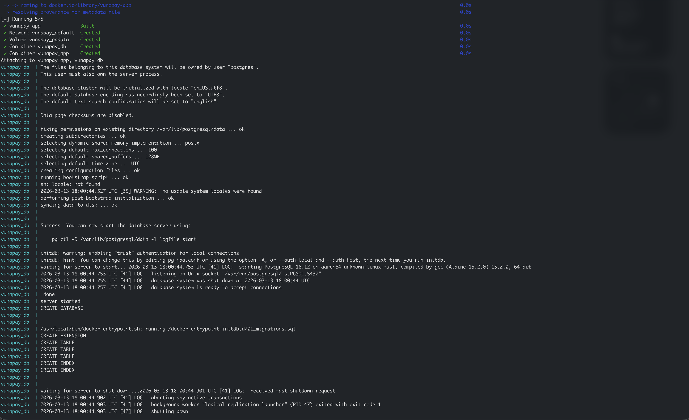
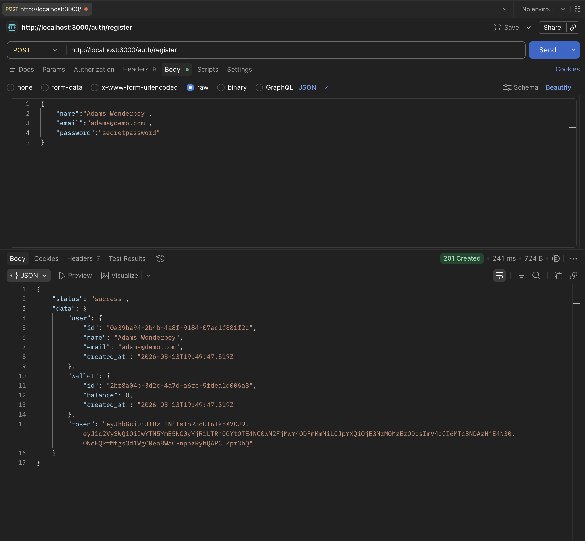
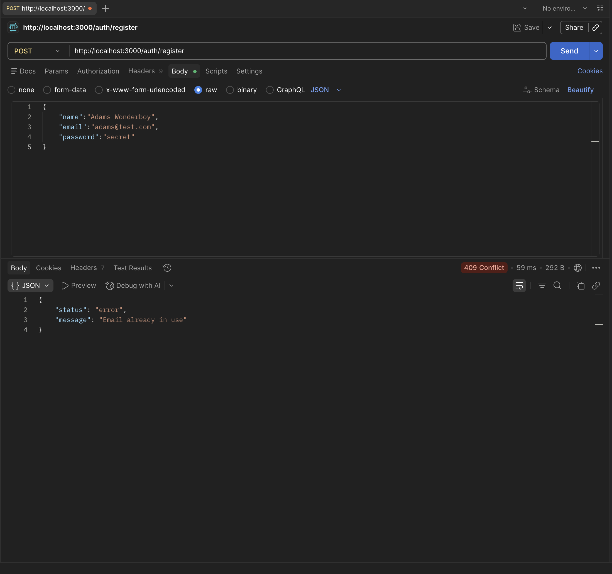
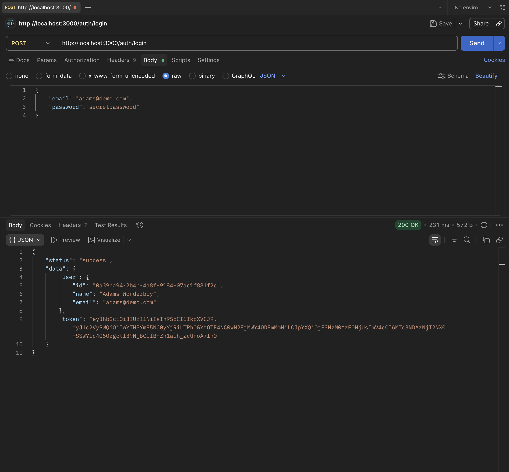
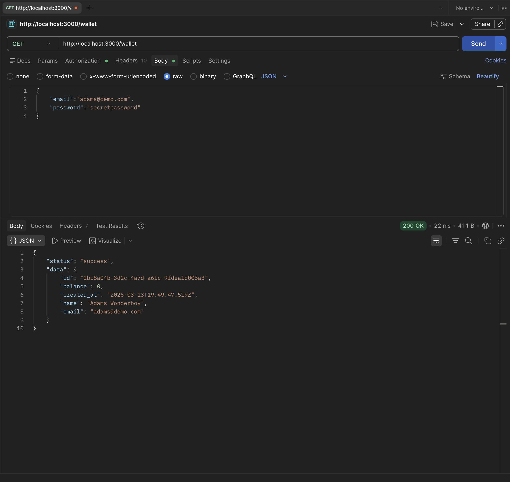
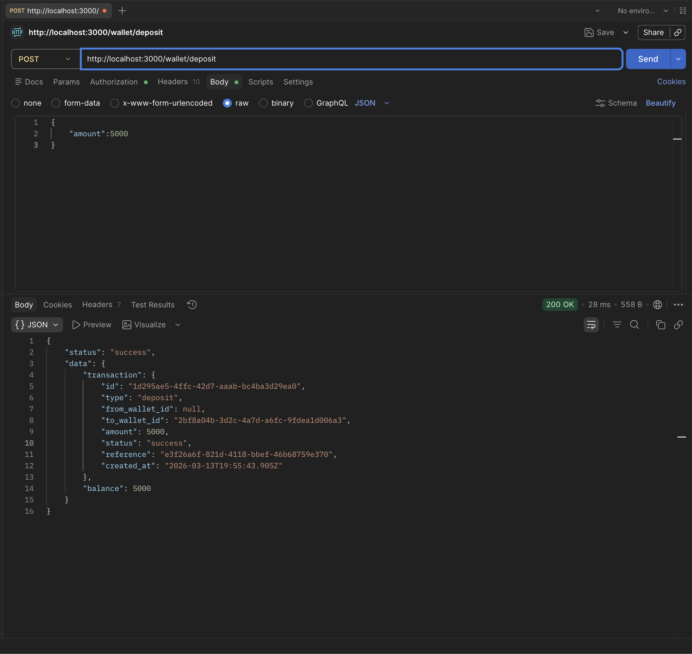
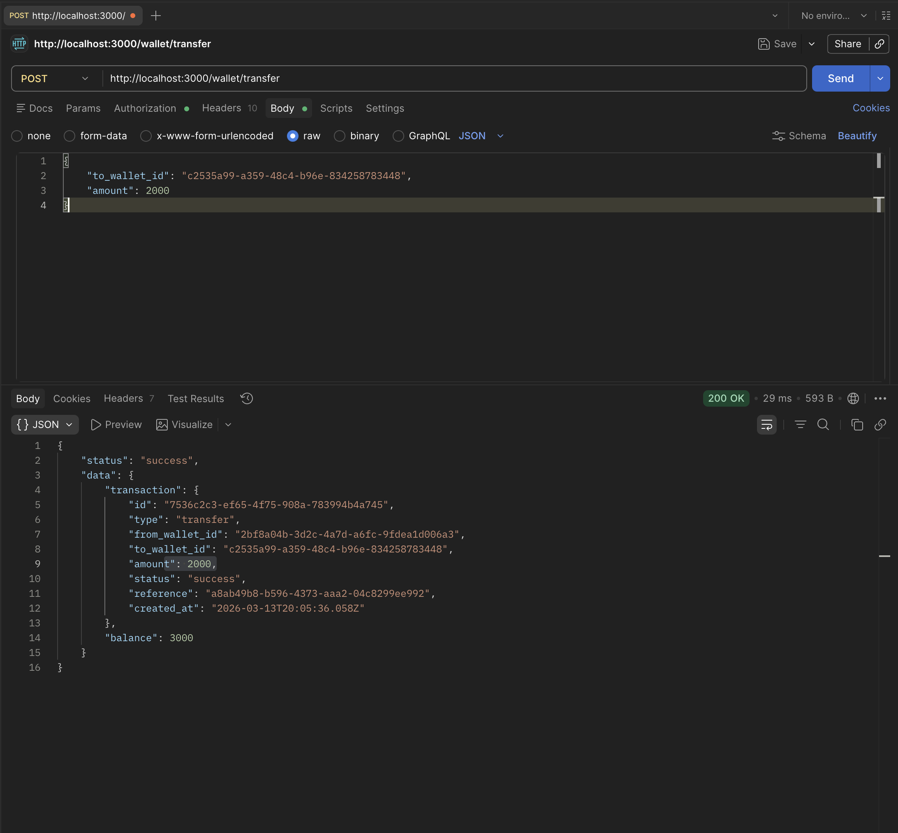
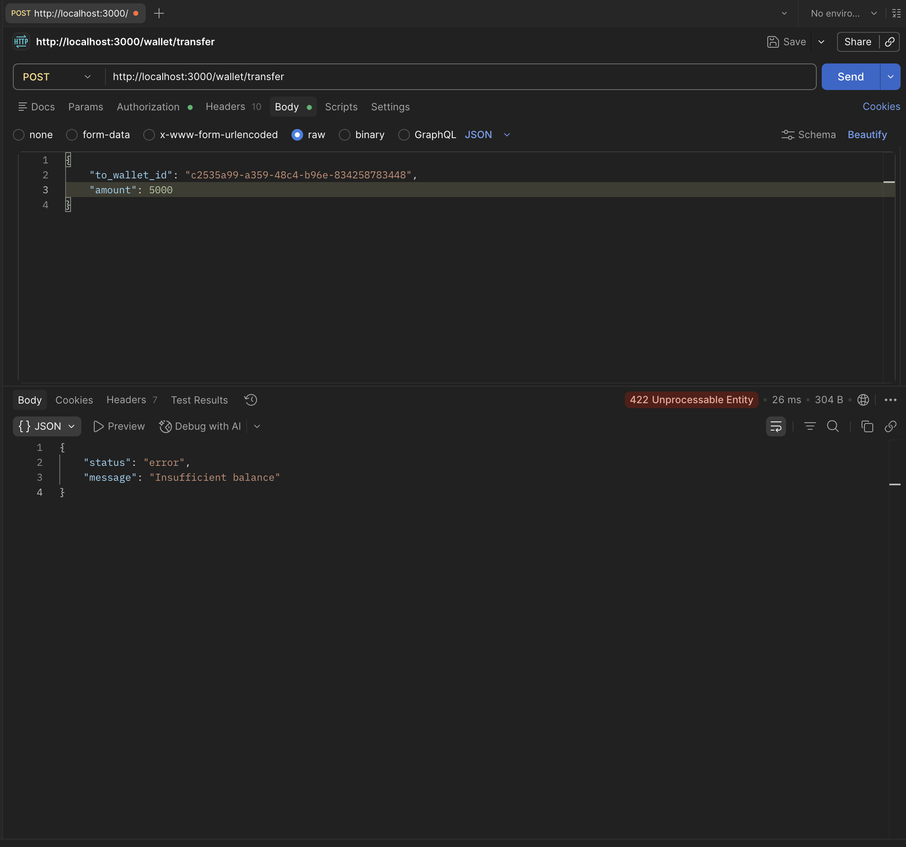
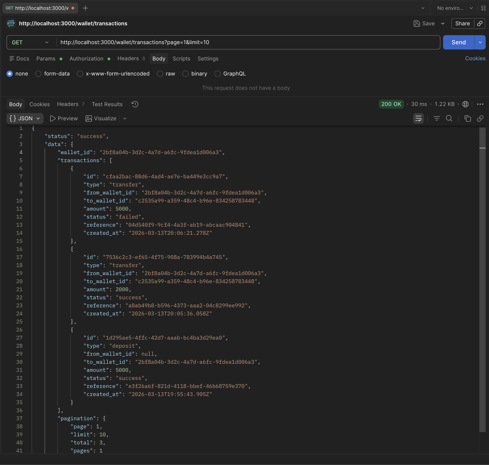

# Mini Wallet Transaction API

A lightweight backend service for managing wallet deposits and peer-to-peer transfers. Built with Node.js, Express, and PostgreSQL.

---

## Stack

- **Runtime:** Node.js
- **Framework:** Express
- **Database:** PostgreSQL (via Docker)
- **Auth:** JWT

---

## Prerequisites

- [Docker](https://www.docker.com/) — the only thing you need. Node.js is not required on your host machine.

---

## Setup

### 1. Clone the repository

```bash
git clone <repo-url>
cd mini-wallet-api
```

### 2. Start everything

```bash
docker compose up --build
```

This single command:
- Builds the Node.js app image
- Starts a PostgreSQL container and runs migrations automatically
- Waits for the database to be healthy before starting the API

The API will be available at `http://localhost:3000`.

### Stopping

```bash
docker compose down          # stop containers, keep data
docker compose down -v       # stop containers and wipe the database
```

---

## API Reference

All amounts are in **kobo** (the smallest Nigerian currency unit). `1000 kobo = ₦10`. Using integers avoids floating-point precision bugs.

### Auth

#### Register
```bash
POST /auth/register
```
```bash
curl -X POST http://localhost:3000/auth/register \
  -H "Content-Type: application/json" \
  -d '{"name": "Adams Wonderboy", "email": "adams@example.com", "password": "securepass"}'
```
```json
{
  "status": "success",
  "data": {
    "user":   { "id": "...", "name": "Adams Wonderboy", "email": "adams@example.com" },
    "wallet": { "id": "...", "balance": 0 },
    "token":  "eyJ..."
  }
}
```

#### Login
```bash
POST /auth/login
```
```bash
curl -X POST http://localhost:3000/auth/login \
  -H "Content-Type: application/json" \
  -d '{"email": "adams@example.com", "password": "securepass"}'
```

---

### Wallet  *(all endpoints require `Authorization: Bearer <token>`)*

#### Get wallet
```bash
GET /wallet
```
```bash
curl http://localhost:3000/wallet \
  -H "Authorization: Bearer <token>"
```
```json
{
  "status": "success",
  "data": { "id": "...", "balance": 5000, "name": "Adams Wonderboy", "email": "adams@example.com" }
}
```

#### Deposit
```bash
POST /wallet/deposit
```
```bash
curl -X POST http://localhost:3000/wallet/deposit \
  -H "Authorization: Bearer <token>" \
  -H "Content-Type: application/json" \
  -d '{"amount": 5000}'
```
```json
{
  "status": "success",
  "data": {
    "transaction": { "id": "...", "type": "deposit", "amount": 5000, "status": "success", ... },
    "balance": 5000
  }
}
```

#### Transfer
```bash
POST /wallet/transfer
```
```bash
curl -X POST http://localhost:3000/wallet/transfer \
  -H "Authorization: Bearer <token>" \
  -H "Content-Type: application/json" \
  -d '{"to_wallet_id": "<recipient-wallet-uuid>", "amount": 2000}'
```
```json
{
  "status": "success",
  "data": {
    "transaction": { "id": "...", "type": "transfer", "amount": 2000, "status": "success", ... },
    "balance": 3000
  }
}
```

#### Transaction history
```bash
GET /wallet/transactions?page=1&limit=20
```
```bash
curl "http://localhost:3000/wallet/transactions?page=1&limit=10" \
  -H "Authorization: Bearer <token>"
```
```json
{
  "status": "success",
  "data": {
    "wallet_id": "...",
    "transactions": [...],
    "pagination": { "page": 1, "limit": 10, "total": 42, "pages": 5 }
  }
}
```

---

## Error Responses

All errors return a consistent shape:

```json
{ "status": "error", "message": "Descriptive message here" }
```

| Scenario                  | Status |
|---------------------------|--------|
| Missing required fields   | 400    |
| Zero or negative amount   | 400    |
| Non-integer amount        | 400    |
| Transfer to self          | 400    |
| Invalid or expired JWT    | 401    |
| Duplicate email           | 409    |
| Wallet not found          | 404    |
| Insufficient balance      | 422    |

---

## Screenshots

#### Docker containers running


#### Register


#### Register — duplicate email


#### Login


#### Get wallet


#### Deposit


#### Transfer


#### Transfer — insufficient balance


#### Transaction history


---

## Design Notes

**Integer amounts** — Balances and transaction amounts are stored in kobo (smallest currency unit) as integers. Floating-point arithmetic is unreliable for money; integers eliminate rounding bugs entirely.

**Row-level locking** — Transfers use `SELECT ... FOR UPDATE` inside a PostgreSQL transaction. This prevents two concurrent transfers from the same wallet both reading the same balance, both passing the balance check, and leaving the wallet negative.

**Failed transactions are recorded** — When a transfer fails due to insufficient balance, a `status: 'failed'` transaction is written (outside the rolled-back transaction) to preserve a full audit trail.

**Immutable ledger** — Transaction rows are never updated or deleted, only inserted.

---

## Resetting the database

```bash
docker compose down -v && docker compose up --build
```

This tears down the containers and their volume, then brings everything back up clean.
